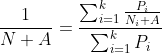

# Grade Calculation
Faça um programa em C que leia o número k de atividades e o fator A de amortização, e em seguida leia k pares de peso e nota para cada atividade. O programa deve então imprimir o valor de N, da fórmula abaixo, com uma casa decimal.

Pode-se assumir que k > 0 é inteiro, que A > 0 é real, que Pi > 0 é real, e que Ni é real.

